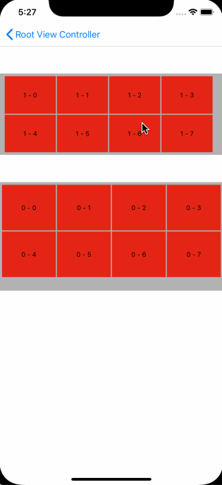

# 小工具库

打算平时积累一些小工具

## PageFlowLayout

#### UICollectionView分页滑动效果

**使用方法：**

把 `PageFlowLayout` 文件夹中的文件拉进项目工程，更换UICollectionView的layout布局

````objective-c
WDCollectionViewPageFlowLayout *flowLayout = [WDCollectionViewPageFlowLayout new];
flowLayout.scrollDirection = UICollectionViewScrollDirectionVertical;
flowLayout.minimumLineSpacing = 2;
flowLayout.minimumInteritemSpacing = 2;
flowLayout.pageInset = UIEdgeInsetsMake(5, 5, 25, 5);
flowLayout.itemCountPerRow = 4;
flowLayout.rowCount = 2;
UICollectionView *collectionView = [[UICollectionView alloc] initWithFrame:CGRectZero collectionViewLayout:flowLayout];
````

每个item的大小通过collectionView的大小和间距计算得出

效果图：



